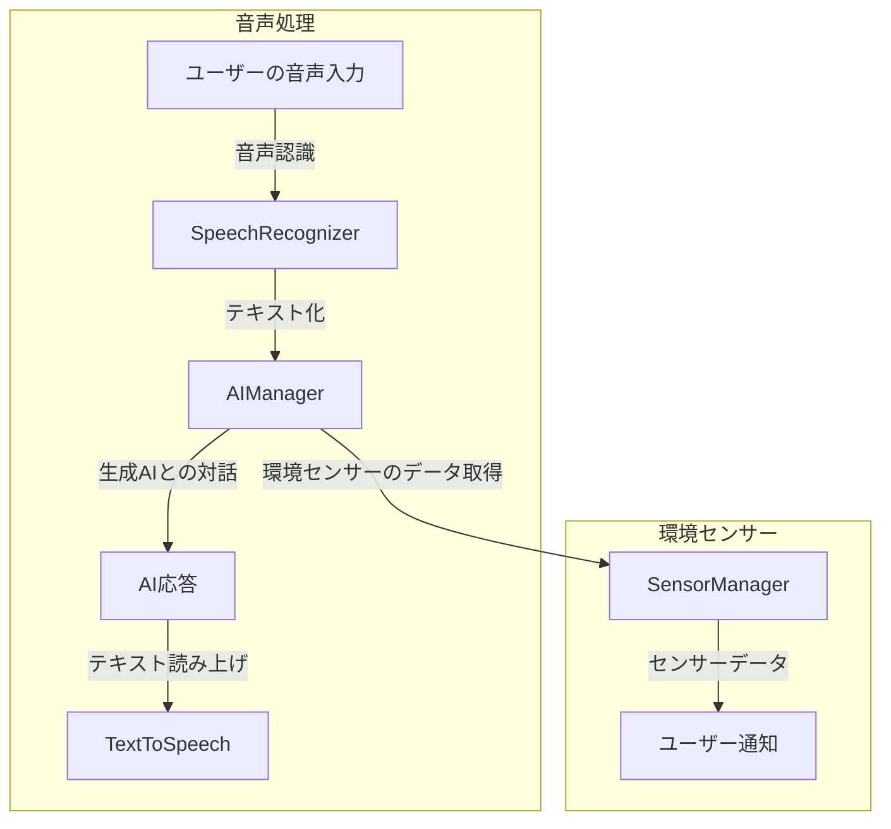

# README.md

# Android Voice App

このプロジェクトは、音声対話アプリケーションを作成するためのAndroidアプリです。ユーザーの音声を認識し、OpenAI APIを利用して生成AIと対話する機能を提供します。

## 機能

- 音声認識: ユーザーの音声を認識し、画面に表示します。
- テキスト読み上げ: AIからの応答を音声として読み上げます。
- 環境センサー: 温度、湿度、照度、気圧を取得し、ユーザーに情報を提供します。

## セットアップ

1. プロジェクトをクローンします。
2. Android Studioを使用してプロジェクトを開きます。
3. 必要なSDKと依存関係をインストールします。
4. アプリをビルドして実行します。

## OpenAI APIキーの取得方法

1. OpenAIのアカウント作成
   - [OpenAI](https://platform.openai.com/)にアクセス
   - アカウントを作成（メールアドレスの確認が必要）

2. APIキーの取得
   - ログイン後、右上のプロフィールから「View API keys」を選択
   - 「Create new secret key」をクリック
   - 生成されたAPIキーをコピー（このキーは一度しか表示されないので注意）

3. APIキーの設定
   - プロジェクトのルートディレクトリに`local.properties`ファイルを作成
   - 以下の行を追加：
     ```
     OPENAI_API_KEY=your_api_key_here
     ```

4. APIキーのテスト
   - 以下のPythonスクリプトを使用してAPIキーをテスト：
    test_OpenAI_APIKEY_check.py

## 使用方法

1. 音声認識
   - 「音声認識を開始」ボタンをタップして音声入力を開始します
   - 音声を認識すると、画面上部のテキストエリアに表示されます
   - 音声入力中は「音声認識を停止」ボタンをタップして終了できます

2. AI対話
   - 音声認識が完了すると「AI問い合わせ」ボタンが有効になります
   - ボタンをタップするとAIに問い合わせを行い、応答を取得します
   - AI応答は画面中央のテキストエリアに表示され、自動的に音声で読み上げられます

3. 環境センサー
   - 「センサー問い合わせ」ボタンをタップすると現在の環境情報を取得します
   - 温度、湿度、照度、気圧の情報が画面下部に表示されます
   - センサー情報は音声でも読み上げられます

4. 操作の中断
   - 処理中は「中断」ボタンが有効になり、タップすると現在の処理を中止できます
   - AI応答の生成中や音声読み上げ中も中断可能です

※ アプリの状態は画面上部のステータス表示で確認できます

## プロジェクト構成

```
android-voice-app
├── app
│   ├── src
│   │   ├── main
│   │   │   ├── java
│   │   │   │   └── com.example.voiceapp
│   │   │   │       ├── MainActivity.kt          # メインアクティビティ
│   │   │   │       ├── SensorManager.kt         # 環境センサーの管理
│   │   │   │       ├── SpeechRecognizer.kt      # 音声認識の実装
│   │   │   │       ├── TextToSpeech.kt          # テキスト読み上げの実装
│   │   │   │       └── AIManager.kt             # AIとの対話管理
│   │   │   ├── res
│   │   │   │   ├── layout
│   │   │   │   │   └── activity_main.xml        # メインアクティビティのレイアウト
│   │   │   │   └── values
│   │   │   │       ├── strings.xml              # 文字列リソース
│   │   │   │       ├── colors.xml               # カラーリソース
│   │   │   │       └── styles.xml               # アプリケーションのスタイル定義
│   │   │   └── AndroidManifest.xml              # アプリの設定、権限、アクティビティ定義
│   ├── build.gradle                             # アプリレベルの依存関係
├── gradle
│   └── wrapper
├── build.gradle                                 # プロジェクトレベルの設定
├── settings.gradle                              # プロジェクト設定
└── local.properties                            # APIキー等のローカル設定（非Git管理）
```

## アプリ構成図



## 将来ビジョン

- チャット形式へ機能統合: 自然な対話になるようにシングルカラムのチャット形式のシンプルなUIへ変更。
- パーソナライズ: ユーザーの名前と人格を設定し、対話をより自然にします。
- AIの疑似人格化：やり取りの履歴を保存し、プロンプトを工夫して「あすかちゃん」のように統一的な人格をつくる
- 気分要素の追加：プロンプトを工夫して、生成AIからAI疑似人格の喜怒哀楽を取得して、感情表現を実現する。できればUIや読み上げ音声に反映。
- 話しかけ機能：音声に応答するだけでなく、定期的にセンサー情報などを元に隠れたリクエストを送り、応答を得ることで、話しかける機能を実装する
- 読み上げ音声の改善

