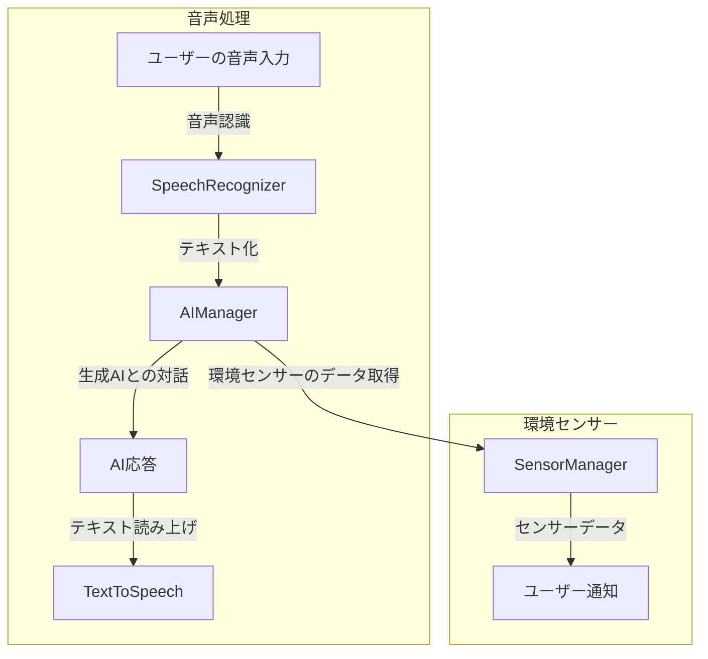

# README.md

# Android Voice App

このプロジェクトは、音声対話アプリケーションを作成するためのAndroidアプリです。ユーザーの音声を認識し、生成AIと対話する機能を提供します。

## 機能

- 音声認識: ユーザーの音声を認識し、画面に表示します。
- テキスト読み上げ: AIからの応答を音声として読み上げます。
- 環境センサー: 温度、湿度、照度、気圧を取得し、ユーザーに情報を提供します。
- パーソナライズ: ユーザーの名前と人格を設定し、対話をより自然にします。

## プロジェクト構成

```
android-voice-app
├── app
│   ├── src
│   │   ├── main
│   │   │   ├── java
│   │   │   │   └── com.example.voiceapp
│   │   │   │       ├── MainActivity.kt        # メインアクティビティ
│   │   │   │       ├── SensorManager.kt       # 環境センサーの管理
│   │   │   │       ├── SpeechRecognizer.kt    # 音声認識の実装
│   │   │   │       ├── TextToSpeech.kt        # テキスト読み上げの実装
│   │   │   │       └── AIManager.kt           # AIとの対話管理
│   │   │   ├── res
│   │   │   │   ├── layout
│   │   │   │   │   └── activity_main.xml      # メインアクティビティのレイアウト
│   │   │   │   └── values
│   │   │   │       ├── strings.xml            # 文字列リソース
│   │   │   │       └── colors.xml             # カラーリソース
│   │   │   └── AndroidManifest.xml            # アプリのマニフェストファイル
│   ├── build.gradle
├── gradle
│   └── wrapper
├── build.gradle
└── settings.gradle
```

## アプリ構成図



## セットアップ

1. プロジェクトをクローンします。
2. Android Studioを使用してプロジェクトを開きます。
3. 必要なSDKと依存関係をインストールします。
4. アプリをビルドして実行します。

## 使用方法

アプリを起動すると、音声認識が開始されます。ユーザーの音声に応じて、AIが応答し、画面に表示されます。また、環境センサーのデータも取得され、必要に応じてユーザーに通知されます。

## ライセンス

このプロジェクトはMITライセンスの下で提供されています。